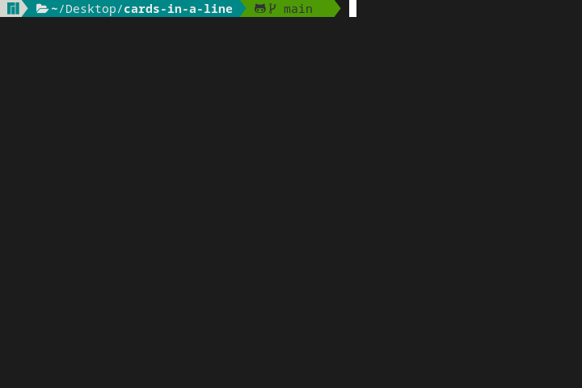

# Cards in a line  
This game is a variant of the coins in a line problem (also known as the pots of gold problem), implemented in Typescript.

## Demo


## Setup
```sh
npm install
```

## Usage
```sh
npm start
```

## Game modes
- Single Player
- MultiPlayer
- Custom (any number of bots or players)

## Strategies

| Strategy      | Description                   | Parameter(s) |
|---------------|-------------------------------|--------------|
| AlwaysFirst   | Always chooses the first card | - |
| AlwaysLast    | Always chooses the last card  | - |
| ChooseMaximum | Compares the values of the two cards and chooses the card having highest value | <li> `choiceIfEqual`: function called to break the tie if the cards have the same value</li><li>Is set to choose randomly by default</li> |
| Clone         | <li>Chooses from the same side as the previous player</li><li>If it is the first move (no player has played previously), then it chooses randomly</li> | - |
| Minimax       | <li>Visualizes all the possible scenarios and finds the most optimal one assuming that the opponent(s) also play optimally, read [this](https://www.geeksforgeeks.org/minimax-algorithm-in-game-theory-set-1-introduction/) for more information</li><li>When it is faced to two scenarios having the same expected scores, it chooses randomly</li><li>Uses dynamnic programming, reducing its complexity from O(2^n), n being the number of cards, to O(n^2)</li> | - |
| Random        | Randomly Chooses one of the two options | <li>`firstProbability`: number representing probability of choosing the first card</li><li>Is set to `0.5` by default</li>|
| UserInput     | Prompts the user to input their choice | - |

## To add a custom strategy
1. Create a file in [./src/Strategies](./src/Strategies)
2. Write a class implementing the `Strategy` interface
3. Add the class to the Strategies object in [./src/Strategies/index.ts](./src/Strategies/index.ts)

## Platforms
Tested on Windows 10 and Linux.

## License
Licensed under the [GNU General Public License v3.0](LICENSE) license.
