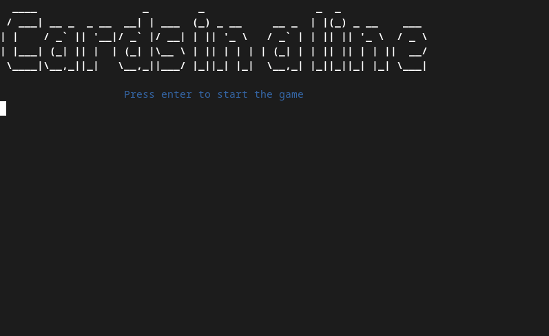

# Cards in a line  
Variant of the coins in a line game using cards, written in Typescript and using node.

## Tutorial
Coming soon...

## Demo


## Quick start

### Setup
```sh
npm install
```

### Running
```sh
npm start
```

## License
Licensed under the [GNU General Public License v3.0](LICENSE) license.